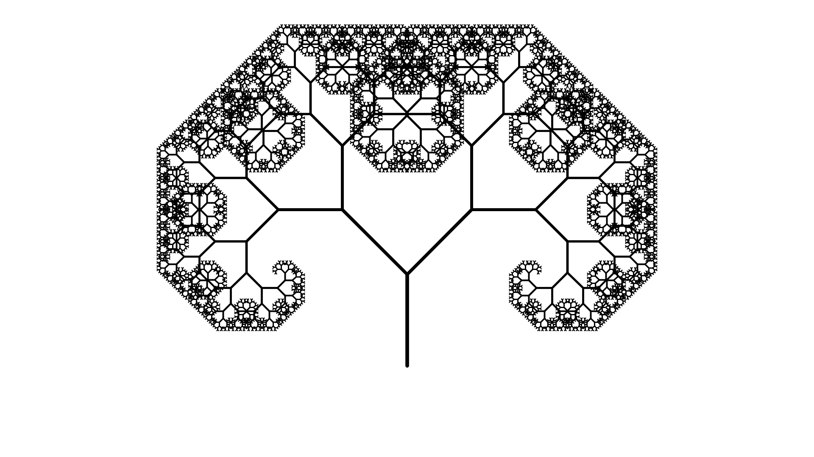

# RecursiveFractals

### About:
Different types of fractals are drawn using recursion and the [StdDraw library](https://introcs.cs.princeton.edu/java/stdlib/StdDraw.java). The constants in each file can be changed to get more new and interesting shapes. Comments are added to see how the code runs.

### Running the program:
1. Clone the repository, download the code, or copy/paste it into a .java file.
2. Choose one of the `.java` files (excluding the `StdDraw.java`) to run.

Ex. of running FractalTree when `ORDER = 15`:

